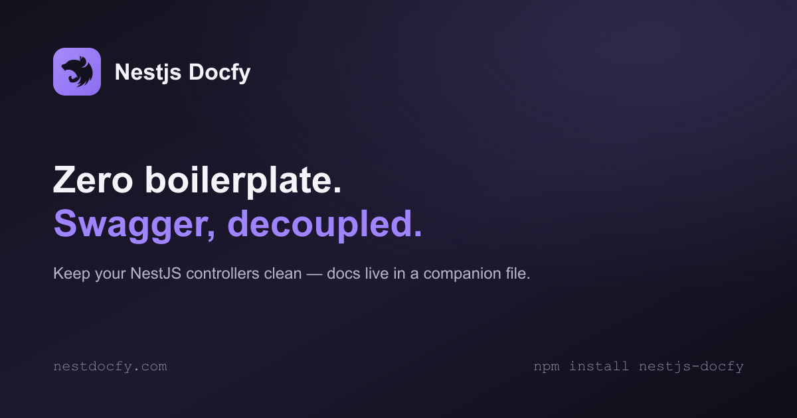

<p align="center">
  
</p>

[](https://github.com/MarvinRF/nest-docfy/actions/workflows/ci.yml)
[](https://www.npmjs.com/package/nestjs-docfy)
[](https://www.npmjs.com/package/nestjs-docfy)
[](https://github.com/MarvinRF/nest-docfy/commits/main)
[](https://github.com/MarvinRF/nest-docfy/issues)
[](https://github.com/MarvinRF/nest-docfy/blob/main/LICENSE)

Keep your NestJS controllers clean. Swagger documentation lives in a dedicated companion file, by naming convention, with zero boilerplate.

📖 **[Full documentation](https://www.nestdocfy.com/)**

## Table of contents

- [Motivation](#motivation)
- [Installation](#installation)
- [Quick start](#quick-start)
  - [1. Import DocfyModule](#1-import-docfymodule)
  - [2. Mark your controllers](#2-mark-your-controllers)
  - [3. Generate companion docs files](#3-generate-companion-docs-files)
  - [4. Fill in the docs file](#4-fill-in-the-docs-file)
- [CLI: generate](#cli-generate)
  - [Options](#options)
  - [Project types](#project-types)
  - [Idempotency and --force](#idempotency-and---force)
- [CLI: check](#cli-check)
- [CLI: coverage](#cli-coverage)
- [CLI: lint](#cli-lint)
- [CLI: patch-spec](#cli-patch-spec)
- [CLI: generate-client](#cli-generate-client)
- [API reference](#api-reference)
  - [DocfyModule.forRoot()](#docfymoduleforrootoptions)
  - [@WithDocs()](#withdocs)
  - [docs()](#docscontrollerclass-config)
  - [attachTagGroups()](#attachtaggroupsdocument)
  - [applyDocfyMetadata()](#applydocfymetadatadocument-options)
  - [DocfyUiModule.setup()](#docfyuimodulesetupmountpath-app-options)
- [Interface-typed DTOs](#interface-typed-dtos)
- [class-validator inference](#class-validator-inference)
- [@HttpCode() support](#httpcode-support)
- [Tag groups (x-tagGroups)](#tag-groups-x-taggroups)
- [File naming convention](#file-naming-convention)
  - [webpack: true build mode](#webpack-true-build-mode)
- [Testing](#testing)
- [How it works](#how-it-works)
- [License](#license)

## Motivation

Swagger decorators are documentation. They have nothing to do with routing logic, validation, or business rules, yet they end up mixed into the same file, doubling its length and burying the code that actually matters.

**Before**: Swagger decorators scattered across your controller.

```ts
// users.controller.ts
@ApiTags('users')
@Controller('users')
export class UsersController {
  @Get()
  @ApiOperation({ summary: 'List all users' })
  @ApiResponse({ status: 200, description: 'OK', type: [UserEntity] })
  findAll(): Promise<UserEntity[]> {
    return this.usersService.findAll();
  }

  @Post()
  @ApiOperation({ summary: 'Create a user' })
  @ApiBody({ type: CreateUserDto })
  @ApiResponse({ status: 201, description: 'Created', type: UserEntity })
  @ApiResponse({ status: 400, description: 'Bad Request' })
  create(@Body() dto: CreateUserDto): Promise<UserEntity> {
    return this.usersService.create(dto);
  }
}
```

**After**: the controller expresses only behavior.

```ts
// users.controller.ts
@WithDocs()
@Controller('users')
export class UsersController {
  findAll(): Promise<UserEntity[]> {
    return this.usersService.findAll();
  }

  create(@Body() dto: CreateUserDto): Promise<UserEntity> {
    return this.usersService.create(dto);
  }
}
```

```ts
// users.controller.docs.ts: all documentation in one place
docs(UsersController, {
  classDecorators: [ApiTags('users')],
  methods: {
    findAll: [
      ApiOperation({ summary: 'List all users' }),
      ApiResponse({ status: 200, description: 'OK', type: [UserEntity] }),
    ],
    create: [
      ApiOperation({ summary: 'Create a user' }),
      ApiBody({ type: CreateUserDto }),
      ApiResponse({ status: 201, description: 'Created', type: UserEntity }),
      ApiResponse({ status: 400, description: 'Bad Request' }),
    ],
  },
});
```

`nestjs-docfy` enforces a clean boundary: controllers express behavior, docs files express documentation. The convention (`*.controller.docs.ts`) mirrors how NestJS already organizes specs (`*.controller.spec.ts`), so it feels natural from day one.

## Installation

```bash
npm install nestjs-docfy
```

**Peer dependencies** (already present in any NestJS project):

```bash
npm install @nestjs/common @nestjs/swagger reflect-metadata
```

## Quick start

### 1. Import DocfyModule

```ts
// app.module.ts
import { Module } from '@nestjs/common';
import { DocfyModule } from 'nestjs-docfy';

@Module({
  imports: [DocfyModule.forRoot()],
})
export class AppModule {}
```

Pass `{ strict: true }` to fail fast at startup when a controller has `@WithDocs()` but no companion file is found. Recommended for CI:

```ts
DocfyModule.forRoot({ strict: true });
```

### 2. Mark your controllers

```ts
// users.controller.ts
import { Controller, Get, Post, Body } from '@nestjs/common';
import { WithDocs } from 'nestjs-docfy';

@WithDocs()
@Controller('users')
export class UsersController {
  // route handlers only, no Swagger decorators here
}
```

### 3. Generate companion docs files

Run the CLI to scan your project and generate a pre-filled `*.controller.docs.ts` for every controller:

```bash
npx nestjs-docfy generate
```

The CLI uses **static analysis only** (no code execution) and auto-detects your project layout: monorepos, Nx workspaces, and Nest CLI monorepos are all supported.

To preview what would be written without touching the filesystem:

```bash
npx nestjs-docfy generate --dry-run
```

### 4. Fill in the docs file

The generated file comes pre-populated with inferred summaries, response types, and common error responses:

```ts
// Generated by nestjs-docfy. Edit freely, use --force to merge new methods
import { docs } from 'nestjs-docfy';
import { ApiTags, ApiOperation, ApiResponse, ApiBody } from '@nestjs/swagger';
import { UsersController } from './users.controller';
import { CreateUserDto } from './dto/create-user.dto';
import { UserEntity } from './entities/user.entity';

docs(UsersController, {
  classDecorators: [ApiTags('users')],
  methods: {
    // GET / → async findAll(): Promise<UserEntity[]>
    findAll: [
      ApiOperation({ summary: 'Find all' }),
      ApiResponse({ status: 200, description: 'OK', type: [UserEntity] }),
    ],

    // POST / → async create(dto: CreateUserDto): Promise<UserEntity>
    create: [
      ApiOperation({ summary: 'Create' }),
      ApiBody({ type: CreateUserDto }),
      ApiResponse({ status: 201, description: 'Created', type: UserEntity }),
      ApiResponse({ status: 400, description: 'Bad Request' }),
    ],
  },
});
```

Edit the file freely; your changes are safe. Running `generate` again will skip existing files. Use `--force` to merge only **new** methods without touching existing ones.

No changes to `main.ts` are needed. `DocfyModule` applies all metadata before `SwaggerModule.createDocument()` is called.

## CLI: generate

```bash
npx nestjs-docfy generate [options]
```

### Options

| Option              | Default                   | Description                                                                                                         |
| ------------------- | ------------------------- | ------------------------------------------------------------------------------------------------------------------- |
| `--root <path>`     | `.`                       | Project root directory                                                                                              |
| `--tsconfig <path>` | auto-detected             | Path to `tsconfig.json`                                                                                             |
| `--pattern <glob>`  | `**/*.controller.ts`      | Glob pattern to find controllers                                                                                    |
| `--out <path>`      | alongside each controller | Output directory for generated files                                                                                |
| `--force`           | `false`                   | Merge new methods into existing docs files (preserves user edits)                                                   |
| `--dry-run`         | `false`                   | Print what would be generated without writing files                                                                 |
| `--quiet`           | `false`                   | Suppress all output except errors (CI-friendly)                                                                     |
| `--format`          | `ts`                      | Output format: `ts` or `js`                                                                                         |
| `--watch`           | `false`                   | Re-generate on controller file changes                                                                              |
| `--register-plugin` | `false`                   | If `webpack: true` is set without the CLI plugin, add `nestjs-docfy` to `nest-cli.json`'s `compilerOptions.plugins` |

### Project types

The CLI auto-detects your project layout, no configuration needed:

| Layout            | Detected when                                        |
| ----------------- | ---------------------------------------------------- |
| Simple project    | `tsconfig.json` at root, no monorepo markers         |
| Nx monorepo       | `nx.json` present                                    |
| Nest CLI monorepo | `nest-cli.json` with `"monorepo": true`              |
| Generic monorepo  | `packages/` or `apps/` with sub-`package.json` files |

### Idempotency and --force

| Scenario                                   | Behavior                                           |
| ------------------------------------------ | -------------------------------------------------- |
| Run `generate` on a clean project          | Creates all docs files                             |
| Run `generate` again (no changes)          | Skips all existing files, safe to run repeatedly   |
| Add a new endpoint, run `generate --force` | Merges new method block, preserves existing arrays |
| Edit a method's decorators, run `--force`  | Your edits are preserved                           |

Add to your `package.json` for convenience:

```json
{
  "scripts": {
    "docs:generate": "nestjs-docfy generate",
    "docs:preview": "nestjs-docfy generate --dry-run"
  }
}
```

## CLI: check

Verify that every controller is fully documented before merging. Exits with code `1` if any drift is detected, designed for CI pipelines.

```bash
npx nestjs-docfy check [options]
```

| Option              | Default              | Description                                                                                                        |
| ------------------- | -------------------- | -------------------------------------------------------------------------------------------------------------------- |
| `--root <path>`     | `.`                  | Project root directory                                                                                             |
| `--tsconfig <path>` | auto-detected        | Path to `tsconfig.json`                                                                                            |
| `--pattern <glob>`  | `**/*.controller.ts` | Glob pattern to find controllers                                                                                   |
| `--format <format>` | `ts`                 | Docs file format to look for: `ts` or `js`                                                                         |
| `--json`            | `false`              | Output a single machine-readable JSON object instead of formatted text: `{ controllersChecked, issues, passed }`   |
| `--quiet`           | `false`              | Suppress all output except errors                                                                                  |

**What it checks:**

- Controllers with HTTP methods but no companion docs file
- Controllers that have methods added since the last `generate` run

**Example output:**

```text
✖ UsersController: undocumented methods: updateProfile, deleteAccount
  → run nestjs-docfy generate --force to merge new methods

✖ 2 controller(s) out of sync.
```

**CI integration:**

```yaml
# GitHub Actions example
- name: Check docs are up to date
  run: npx nestjs-docfy check
```

Or as an npm script:

```json
{
  "scripts": {
    "docs:check": "nestjs-docfy check"
  }
}
```

## CLI: coverage

Measure what percentage of your endpoints are documented. Useful as an objective quality metric and as a CI gate.

```bash
npx nestjs-docfy coverage [options]
```

| Option              | Default              | Description                                                                                                                  |
| ------------------- | -------------------- | ---------------------------------------------------------------------------------------------------------------------------- |
| `--root <path>`     | `.`                  | Project root directory                                                                                                       |
| `--tsconfig <path>` | auto-detected        | Path to `tsconfig.json`                                                                                                      |
| `--pattern <glob>`  | `**/*.controller.ts` | Glob pattern to find controllers                                                                                             |
| `--format <format>` | `ts`                 | Docs file format to look for: `ts` or `js`                                                                                   |
| `--min <percent>`   | none                 | Minimum coverage required (0-100), exits `1` if below                                                                       |
| `--json`            | `false`              | Output a single machine-readable JSON object instead of formatted text: the `CoverageReport` fields plus `min` and `passed` |
| `--quiet`           | `false`              | Suppress all output except errors                                                                                            |

**Example output:**

```text
Controllers: 42
Endpoints: 187

Documented: 174
Missing docs: 13

Coverage: 93.0%
```

**Enforcing a minimum in CI:**

```bash
npx nestjs-docfy coverage --min 95
```

When coverage falls below `--min`, the command exits with code `1`, failing the build.

```yaml
# GitHub Actions example
- name: Enforce documentation coverage
  run: npx nestjs-docfy coverage --min 95
```

Or as an npm script:

```json
{
  "scripts": {
    "docs:coverage": "nestjs-docfy coverage --min 95"
  }
}
```

**PR bot**: this repo's own [`.github/workflows/pr-check.yml`](.github/workflows/pr-check.yml) is a real example of a GitHub Actions job that runs `check --json` and `coverage --json --min` against a project and posts (and updates, never spams) a single PR comment summarizing the result. See [`.github/scripts/pr-comment.mjs`](.github/scripts/pr-comment.mjs) for the comment logic, built entirely on `--json` output and native `fetch`, no extra dependencies.

## CLI: lint

Checks documentation **quality**, not just presence. Catches incomplete `ApiOperation`, `ApiResponse`, and `ApiBody` decorators that `check` and `coverage` wouldn't flag (the method is documented, just incompletely).

```bash
npx nestjs-docfy lint [options]
```

| Option              | Default              | Description                                |
| ------------------- | -------------------- | ------------------------------------------ |
| `--root <path>`     | `.`                  | Project root directory                     |
| `--tsconfig <path>` | auto-detected        | Path to `tsconfig.json`                    |
| `--pattern <glob>`  | `**/*.controller.ts` | Glob pattern to find controllers           |
| `--format <format>` | `ts`                 | Docs file format to look for: `ts` or `js` |
| `--quiet`           | `false`              | Suppress all output except errors          |

**What it checks**, for every method already present in a docs file:

- `ApiOperation` missing a `summary`
- Endpoints with a `@Body()` parameter missing a `400` `ApiResponse`
- Endpoints with a `@Body()` parameter missing an `ApiBody` `description`

Controllers without a companion docs file, or methods not yet documented at all, are left to `check`. `lint` only judges the quality of what's already there.

**Example output:**

```text
✖ POST /users
  Missing 400 response

✖ GET /users
  Missing operation summary

✖ PATCH /users/:id
  Missing request body description

✖ 3 issue(s) found.
```

Exits with code `1` if any issue is found, designed for CI pipelines, same as `check`.

```yaml
# GitHub Actions example
- name: Lint documentation quality
  run: npx nestjs-docfy lint
```

Or as an npm script:

```json
{
  "scripts": {
    "docs:lint": "nestjs-docfy lint"
  }
}
```

## CLI: patch-spec

Patches an **already-built** OpenAPI document with every controller's companion docs file, entirely via static analysis (`ts-morph`). No `require()` of any docs file, no decorators applied to any class, no dependency on a live class reference matching the one the running app actually uses.

This is a manual, CI-driven way to work around the one thing `DocfyModule`'s runtime pipeline structurally cannot do: work under NestJS CLI's `webpack: true` build mode (see [`webpack: true` build mode](#webpack-true-build-mode) for why, and for the **CLI plugin**, which does the same analysis automatically on every build instead of a separate step). `patch-spec` sidesteps the webpack wall by matching on **path + HTTP method**, computed the same way `check`/`coverage`/`lint` already do, instead of needing the live controller class.

```bash
npx nestjs-docfy patch-spec --spec <path-or-url> [options]
```

| Option               | Default              | Description                                                         |
| -------------------- | -------------------- | ------------------------------------------------------------------- |
| `--spec <path\|url>` | _(required)_         | A local `openapi.json`, or a URL (e.g. a running app's `/api-json`) |
| `--out <path>`       | stdout               | Where to write the patched document                                 |
| `--root <path>`      | `.`                  | Project root directory                                              |
| `--tsconfig <path>`  | auto-detected        | Path to `tsconfig.json`                                             |
| `--pattern <glob>`   | `**/*.controller.ts` | Glob pattern to find controllers                                    |
| `--format <format>`  | `ts`                 | Docs file format to look for: `ts` or `js`                          |
| `--quiet`            | `false`              | Suppress all output except errors                                   |

```bash
# Patch a running app's served document
npx nestjs-docfy patch-spec --spec http://localhost:3000/api-json --out openapi.json

# Patch a file already written to disk
npx nestjs-docfy patch-spec --spec dist/openapi.json --out dist/openapi.json
```

**What gets merged**, matched by `path` + HTTP method against the base document:

- `ApiTags` → unioned into `tags` (never drops tags the base document already had)
- `ApiOperation({ summary, description, deprecated })` → overwrites those fields
- `ApiResponse({ status, description, schema, example, examples })` → merged per status code (other status codes untouched); when no `schema`/`type` is given, falls back to the method's own resolved return type, the same DTO/class-validator/interface inference `generate` already does, including a `oneOf` of `$ref`s when the return type is a union of ≥2 named DTOs/entities (e.g. `Promise<UserDto | AdminDto>`)
- `ApiBody({ schema, examples })` → sets `requestBody`, with the same return-type-style fallback to the `@Body()` parameter's resolved type, including the same union → `oneOf` handling (`example` is intentionally not read here, since `@nestjs/swagger`'s real `ApiBodyOptions` type only has `examples`, unlike `ApiResponse`, which supports both)
- `ApiBearerAuth()` → appended to `security`
- `ApiParam` / `ApiQuery` / `ApiHeader` → merged into `parameters` by name + location: a genuinely new parameter is appended, but one that already exists (e.g. `@nestjs/swagger` auto-generates a bare `required: true` entry from reflection alone for any `@Query()`/`@Param()`-decorated argument, with zero `@Api*` decorators needed) gets its fields overlaid, not discarded. An `ApiQuery({ enum, required: false })` in a docs file for a parameter Nest already knew about actually takes effect. `enum` is read from an array literal (`enum: ['a', 'b']`) or a reference to a TS `enum`, including one imported from another file (`enum: Role`), and the schema's `type` is inferred as `number` when every resolved value is numeric, `string` otherwise

`example`/`examples` (and `schema`) are only applied when every value inside them is a literal. If even one nested value is a variable, function call, or other non-literal expression, the whole field is left out rather than risk leaking an internal "unresolved" marker into the document as if it were real data.

**What this does _not_ do** (yet, since this command is intentionally scoped, not a full reimplementation of `@nestjs/swagger`'s decorator semantics): `anyOf` (no TS construct maps onto "any of" the way a union type naturally maps onto `oneOf`), `links`/`callbacks` (`@nestjs/swagger` itself has no decorator option for either, so there's nothing in a `.docs.ts` file to read), and any decorator argument that isn't a literal (a variable, a function call, a spread) are left alone rather than guessed at. It's better to leave a field as the base document already had it than patch in something wrong. A union return type or `@Body()` payload only becomes a `oneOf` when _every_ branch resolves to a named DTO/entity. A partial guess is avoided by leaving the field alone entirely (falling back to no schema, same as an unresolvable type) if even one branch doesn't resolve. Routes a docs file documents that don't exist in `--spec` are reported as warnings, not silently dropped or errored on.

## CLI: export

Boots the project's **own** Nest app and writes the OpenAPI document it produces, without binding a port. Unlike `patch-spec`, this builds the base document too (via a real `SwaggerModule.createDocument()`) — it doesn't need one to already exist.

The one thing `SwaggerModule.createDocument()` structurally needs is a fully-initialized Nest app — its DI container has to have resolved every provider before route/DTO metadata exists to introspect. That does **not** require `.listen()` (no port bound), and in practice usually doesn't require live infrastructure either: most `TypeOrmModule`/`ioredis`/`kafkajs`-style clients connect lazily rather than blocking bootstrap, so `export` tends to work with the database, Redis, Kafka, etc. all stopped. A provider with a genuinely eager, hard-failing connection in its constructor or `onModuleInit` won't benefit from this — nothing here can change how your own providers connect.

You provide a small **entry file** — the same handful of lines your `main.ts` already has, minus `.listen()` and anything unrelated to the document itself:

```ts
// docfy-export.ts
import { NestFactory } from '@nestjs/core';
import { DocumentBuilder, SwaggerModule } from '@nestjs/swagger';
import { AppModule } from './app.module';

export default async function () {
  const app = await NestFactory.create(AppModule, { logger: false });
  const config = new DocumentBuilder().setTitle('My API').setVersion('1.0.0').build();
  const document = SwaggerModule.createDocument(app, config);
  return { app, document }; // `app` gets closed for you afterward
}
```

```bash
npx nestjs-docfy export --entry docfy-export.ts --out openapi.json
```

| Option           | Default      | Description                                                        |
| ---------------- | ------------ | -------------------------------------------------------------------- |
| `--entry <path>` | _(required)_ | `.ts`/`.js` file whose default export returns `{ app, document }`  |
| `--out <path>`   | stdout       | Where to write the document                                        |
| `--root <path>`  | `.`          | Project root — where `ts-node`/`tsconfig-paths` are resolved from  |
| `--quiet`        | `false`      | Suppress informational output (errors still go to stderr)          |

A `.ts` entry file needs `ts-node` as a devDependency of your project (for `tsconfig-paths` support too, if your project uses path aliases like `@app/common`). Informational output always goes to stderr, never stdout — safe to pipe: `npx nestjs-docfy export --entry docfy-export.ts > openapi.json`.

## CLI: generate-client

Generates a typed TypeScript client from an OpenAPI document, a thin wrapper over [`openapi-typescript`](https://openapi-ts.dev) (types) and [`openapi-fetch`](https://openapi-ts.dev/openapi-fetch) (the runtime client), not a from-scratch code generator.

```bash
npx nestjs-docfy generate-client --spec <path-or-url> [options]
```

| Option               | Default              | Description                                                         |
| -------------------- | -------------------- | ------------------------------------------------------------------- |
| `--spec <path\|url>` | _(required)_         | A local `openapi.json`, or a URL (e.g. a running app's `/api-json`) |
| `--out <path>`       | `./generated-client` | Output directory for `schema.d.ts` and `client.ts`                  |
| `--root <path>`      | `.`                  | Project root directory                                              |
| `--quiet`            | `false`              | Suppress all output except errors                                   |

```bash
npx nestjs-docfy generate-client --spec http://localhost:3000/api-json --out src/api-client
```

Writes two files:

- **`schema.d.ts`**: the generated types (`paths`, `components`, `operations`), via `openapi-typescript`.
- **`client.ts`**: a small wrapper exporting `createApiClient(baseUrl)`, typed against `schema.d.ts`.

```ts
import { createApiClient } from './api-client/client';

const api = createApiClient('https://api.example.com');
const { data, error } = await api.GET('/users/{id}', { params: { path: { id: '123' } } });
```

`openapi-fetch` is **not** a dependency of `nestjs-docfy` itself, since only the generated `client.ts` imports it, so install it in your own project: `npm install openapi-fetch`.

## API reference

### `DocfyModule.forRoot(options?)`

Registers the module and loads all companion docs files for controllers marked with `@WithDocs()`.

| Option   | Type      | Default | Description                                                                                    |
| -------- | --------- | ------- | ---------------------------------------------------------------------------------------------- |
| `strict` | `boolean` | `false` | Throw at startup if a `@WithDocs()` controller has no companion docs file. Recommended for CI. |

### `@WithDocs()`

Class decorator that marks a controller for companion file discovery. Pair with `@Controller()`.

```ts
@WithDocs()
@Controller('products')
export class ProductsController { ... }
```

Also sets `DOCFY_MARKER` metadata on the class, available for external introspection:

```ts
import { DOCFY_MARKER } from 'nestjs-docfy';

Reflect.getMetadata(DOCFY_MARKER, ProductsController); // true
```

### `docs(controllerClass, config)`

Applies Swagger decorators to a controller class from outside its file. Call at the top level of a `*.controller.docs.ts` file; runs as a side effect on import.

Fully type-safe: `config.methods` only accepts keys that exist on the controller class. Typos are caught at compile time.

```ts
docs(UsersController, {
  classDecorators: [ApiTags('users')],
  methods: {
    findAll: [...],    // ✔ exists on UsersController
    typoMethod: [...], // ✖ TypeScript error
  },
});
```

**`config.classDecorators`** (`ClassDecorator[]`): applied to the class constructor (e.g. `ApiTags`, `ApiBearerAuth`).

**`config.methods`** (`Partial<Record<keyof T, MethodDecorator[]>>`): decorator arrays per method name, applied in order.

**`config.group`** (`string`): logical group name for ReDoc's `x-tagGroups` extension. See [Tag groups](#tag-groups-x-taggroups).

**`config.tags`** (`string[]`): tag names associated with `group`. Should match what you pass to `ApiTags()`.

If a method key does not exist on the controller at runtime, a warning is logged and that entry is skipped. The rest of the docs file still applies.

### `attachTagGroups(document)`

Adds the `x-tagGroups` extension to a Swagger document, built from groups registered via `docs({ group, tags })`. Call after `SwaggerModule.createDocument()` and before `SwaggerModule.setup()`. Returns the document unchanged if no groups were registered. See [Tag groups](#tag-groups-x-taggroups) for a full example.

### `applyDocfyMetadata(document, options?)`

Merges the build-time metadata produced by the `nestjs-docfy` [CLI plugin](#webpack-true-build-mode) into an already-built OpenAPI document. Call after `SwaggerModule.createDocument()`, same as `attachTagGroups()`. This is the automatic, `webpack: true`-compatible alternative to manually running `patch-spec`.

```ts
import { applyDocfyMetadata } from 'nestjs-docfy';

const document = SwaggerModule.createDocument(app, config);
SwaggerModule.setup('api', app, applyDocfyMetadata(document));
```

| Option         | Type      | Default                                              | Description                                                            |
| -------------- | --------- | ---------------------------------------------------- | ---------------------------------------------------------------------- |
| `metadataPath` | `string`  | `docfy-metadata.json` next to the running entry file | Where to read the plugin-generated metadata from.                      |
| `strict`       | `boolean` | `false`                                              | Throw instead of warning when the metadata file is missing or invalid. |

If the metadata file isn't found (e.g. the plugin isn't registered in `nest-cli.json`), it warns and returns the document unchanged, the same fail-open default as `DocfyModule.forRoot()`.

### `DocfyUiModule.setup(mountPath, app, options?)`

Serves [`docfy-ui`](https://www.npmjs.com/package/docfy-ui) (the AI-first documentation UI companion to this package) at `mountPath`, the same role `SwaggerModule.setup()` + `swagger-ui-express` play for raw Swagger UI. Works on both Express (`@nestjs/platform-express`) and Fastify (`@nestjs/platform-fastify`) apps. On Fastify, static asset serving needs the optional peer dependency [`@fastify/static`](https://www.npmjs.com/package/@fastify/static) (`npm install @fastify/static`), the same package `@nestjs/swagger` itself relies on for Fastify Swagger UI support.

```ts
import { NestFactory } from '@nestjs/core';
import { SwaggerModule, DocumentBuilder } from '@nestjs/swagger';
import { DocfyUiModule } from 'nestjs-docfy';

const app = await NestFactory.create(AppModule);

DocfyUiModule.setup('/docs', app); // before SwaggerModule.setup, see staticSpecPath below

const document = SwaggerModule.createDocument(app, new DocumentBuilder().build());
SwaggerModule.setup('api', app, document); // exposes /api-json, which docfy-ui fetches by default

await app.listen(3000);
```

Visit `/docs`: no further configuration needed, since `docfy-ui` fetches `/api-json` same-origin by default.

| Option           | Type     | Default | Description                                                                                   |
| ---------------- | -------- | ------- | --------------------------------------------------------------------------------------------- |
| `staticSpecPath` | `string` | —       | Path to a pre-built OpenAPI JSON file, served at `/api-json` _instead of_ the app's live one. |

**`staticSpecPath`: needed if your app builds with `"webpack": true`, and you're not using the [CLI plugin](#webpack-true-build-mode).** `DocfyModule`'s runtime metadata pipeline cannot apply docs files there, so the live `/api-json` will be missing everything docs files would otherwise add. Generate a patched document ahead of time:

```bash
npx nestjs-docfy patch-spec --spec http://localhost:3000/api-json --out openapi.patched.json
```

Then serve that instead:

```ts
DocfyUiModule.setup('/docs', app, { staticSpecPath: './openapi.patched.json' });
```

Call this **before** `SwaggerModule.setup()`: Express resolves routes in registration order, so the static, patched document takes precedence over the live one for any request to `/api-json`.

> **Fastify caveat**: `SwaggerModule.setup()` also registers its own `/api-json` route by default. On Express, whichever route is registered first silently wins. On Fastify, registering the same exact route twice throws `FST_ERR_DUPLICATED_ROUTE` at startup instead. Registration order does not save you. When using `staticSpecPath` together with Fastify, point `SwaggerModule.setup()` at a different `jsonDocumentUrl`, or pass `{ raw: false }`, so it doesn't also claim `/api-json`.
>
> `docfy-ui` reads the mount prefix `DocfyUiModule.setup()` injects (`window.__DOCFY_BASE_PATH__`) and passes it as `BrowserRouter`'s `basename`, so deep client-side routes (e.g. reloading an endpoint's detail page directly) resolve correctly at any `mountPath`, not just `/`.

## Interface-typed DTOs

When a response or body type is a TypeScript `interface` (not a class), Swagger cannot use it as a `type:` value because interfaces are erased at runtime. `nestjs-docfy` detects this automatically and generates an inline `schema:` object instead. **No changes to your code required.**

```ts
// Your existing interface, no need to convert to a class
export interface RegisterResponseDto {
  success: boolean;
  message: string | null;
}
```

Generated output:

```ts
ApiResponse({
  status: 201,
  description: 'Created',
  schema: {
    type: 'object',
    properties: {
      success: { type: 'boolean' },
      message: { type: 'string', nullable: true },
    },
    required: ['success'],
  },
}),
```

Supports: primitives, nullable unions (`T | null`), arrays, nested interfaces, and optional properties (excluded from `required`).

## class-validator inference

When a DTO class uses `class-validator` decorators and does **not** already have `@ApiProperty` on its properties, `nestjs-docfy` infers a full JSON Schema from the validator decorators. No manual annotation required.

```ts
// create-user.dto.ts
import { IsString, IsEmail, MinLength, IsOptional } from 'class-validator';

export class CreateUserDto {
  @IsString()
  @MinLength(2)
  name: string;

  @IsEmail()
  email: string;

  @IsOptional()
  @IsString()
  bio?: string;
}
```

Generated output:

```ts
ApiBody({
  schema: {
    type: 'object',
    properties: {
      name:  { type: 'string', minLength: 2 },
      email: { type: 'string', format: 'email' },
      bio:   { type: 'string' },
    },
    required: ['name', 'email'],
  },
}),
```

Supported decorators: `@IsString`, `@IsEmail`, `@IsUrl`, `@IsUUID`, `@IsDateString`, `@IsNumber`, `@IsInt`, `@IsBoolean`, `@IsArray`, `@Min`, `@Max`, `@MinLength`, `@MaxLength`, `@IsOptional`.

> If any property in the class already has `@ApiProperty`, inference is skipped and `type: ClassName` is used instead. Your existing Swagger annotations are never overwritten.

## @HttpCode() support

NestJS's `@HttpCode()` decorator overrides the default HTTP status code for a route handler. `nestjs-docfy` reads it automatically and uses the correct code in the generated `ApiResponse`.

```ts
// users.controller.ts
@Post('logout')
@HttpCode(204)
logout(): void { ... }
```

Generated output:

```ts
logout: [
  ApiOperation({ summary: 'Logout' }),
  ApiResponse({ status: 204, description: 'No Content' }),
],
```

Without `@HttpCode()`, the default codes apply: `201` for `@Post`, `200` for all other HTTP verbs.

## Tag groups (x-tagGroups)

Pass `group` and `tags` to `docs()` to organize controllers under logical sections in tools that support the `x-tagGroups` OpenAPI extension, most notably [ReDoc](https://github.com/Redocly/redoc).

```ts
// users.controller.docs.ts
docs(UsersController, {
  classDecorators: [ApiTags('users')],
  group: 'Administration',
  tags: ['users'],
});

// roles.controller.docs.ts
docs(RolesController, {
  classDecorators: [ApiTags('roles')],
  group: 'Administration',
  tags: ['roles'],
});
```

`tags` should match what you already pass to `ApiTags()`. `nestjs-docfy` does not call `ApiTags` for you, it only builds the `x-tagGroups` mapping from what you declare.

To actually attach the groups to the generated document, call `attachTagGroups()` after `SwaggerModule.createDocument()`:

```ts
// main.ts
import { SwaggerModule, DocumentBuilder } from '@nestjs/swagger';
import { attachTagGroups } from 'nestjs-docfy';

const config = new DocumentBuilder().setTitle('My API').build();
const document = SwaggerModule.createDocument(app, config);

SwaggerModule.setup('api', app, attachTagGroups(document));
```

Generated extension:

```yaml
x-tagGroups:
  - name: Administration
    tags:
      - users
      - roles
```

Multiple `docs()` calls can contribute to the same group; tags are merged and deduplicated. `attachTagGroups()` is a no-op (returns the document unchanged) when no controller declares a `group`.

## File naming convention

Discovery is automatic. `DocfyModule` locates each controller's source file via Node's module cache and resolves the companion path. This works identically in `ts-node` (development) and compiled `dist/` (production).

| Controller file       | Companion docs file        |
| --------------------- | -------------------------- |
| `users.controller.ts` | `users.controller.docs.ts` |
| `users.controller.js` | `users.controller.docs.js` |

> **Barrel re-exports**: if your controller is also exported from an `index.ts` barrel, make sure the class is exported directly from its own module file. `nestjs-docfy` prefers `.controller.ts` over barrel files.

### `webpack: true` build mode

If your `nest-cli.json` has `"webpack": true` under `compilerOptions` (the documented default for monorepos with multiple apps), `DocfyModule`'s **runtime** pipeline (the `@WithDocs()` + `require.cache` discovery described above) will not work, and there is no configuration that makes it work. This is architectural, not a bug to be patched around:

- Webpack inlines every module into one bundle file and never populates Node's `require.cache` with an entry per original source file, which is what the discovery mechanism above depends on. You'll see `Could not locate source file for X` for every `@WithDocs()` controller.
- Even if that lookup is worked around (e.g. by recovering the original path from the bundle's source map, sidestepping `require.cache` entirely), there's a second, unavoidable wall: a docs file required from outside the bundle creates a structurally different class object than the one the running app actually uses internally. Decorating that fresh copy has no effect on the document `SwaggerModule.createDocument()` actually serves, silently, with no error. This path-recovery layer was built and tested before discovering this; it isn't shipped, because "looks like it loaded, does nothing" is worse than the current loud, accurate warning.
- The only way around this would be for the controller's own file to import its `.docs.ts` companion (forcing webpack to bundle them together), which defeats the entire point of the convention: zero coupling between a controller and its documentation.

There are two ways to get full docs under `webpack: true`, in order of preference:

#### 1. The CLI plugin (recommended): fixes it at the root, automatically, on every build

Register `nestjs-docfy` as a NestJS CLI compiler plugin in `nest-cli.json`:

```json
{
  "compilerOptions": {
    "webpack": true,
    "plugins": ["nestjs-docfy"]
  }
}
```

This is the same mechanism `@nestjs/swagger`'s own CLI plugin uses to work under `webpack: true`. That's why `@ApiProperty()` isn't required on every DTO property even in a webpack build. The Nest CLI feeds a TypeScript compiler-plugin hook (`compilerOptions.plugins`) into both the `tsc` and the `webpack` (`ts-loader`) builder identically. `nestjs-docfy`'s plugin doesn't rewrite any decorator syntax or touch the AST at all. On every compilation it re-runs the exact same static analysis `generate`/`check`/`patch-spec` already do (via `ts-morph`, against the source tree, not the bundle) and writes the resulting patch to `docfy-metadata.json` next to your build output. There's no `require.cache` involved and no bundled-class-identity problem, because it never needs the running app to compute anything.

Then, right after `SwaggerModule.createDocument()`, merge that file into the document:

```ts
import { applyDocfyMetadata } from 'nestjs-docfy';

const document = SwaggerModule.createDocument(app, config);
SwaggerModule.setup('api', app, applyDocfyMetadata(document));
```

`applyDocfyMetadata()` reads `docfy-metadata.json` from next to your compiled entry file by default. Pass `{ metadataPath }` to point somewhere else. If the file is missing (e.g. the plugin isn't registered), it warns and returns the document unchanged; pass `{ strict: true }` to throw instead, the same `strict` convention `DocfyModule.forRoot()` already uses.

#### 2. `patch-spec` (manual, CI-driven): the same analysis, run as a separate step

If you'd rather not add a compiler plugin (e.g. a build pipeline that isn't the Nest CLI, or a stricter policy about what runs during compilation), [`patch-spec`](#cli-patch-spec) computes the identical patch by hand against an already-built document. See that section for usage. This was the only option before the CLI plugin existed, and remains useful for one-off patching (e.g. patching a document fetched from a _different_ running instance than the one being built).

Disabling webpack entirely (`"webpack": false` or removing the key) also works, if you don't need it for another reason: under `nest build`'s default `tsc`-based compilation, every source file, including each `*.controller.docs.ts`, gets compiled to its own `.js` file in `dist/`, so `require.cache` naturally has one entry per file and `DocfyModule`'s runtime discovery works exactly as documented above, no special configuration needed.

## Testing

Reset the controller registry between test suites to avoid cross-contamination:

```ts
import { resetDocfyRegistry } from 'nestjs-docfy/testing';

beforeEach(() => resetDocfyRegistry());
```

## How it works

`DocfyModule.forRoot()` runs synchronously during the `NestFactory.create()` phase, before `SwaggerModule.createDocument()` is called. It uses `require()` to load each companion docs file, which executes `docs()` and writes `Reflect` metadata directly onto the controller methods, exactly as TypeScript decorator syntax would at class-definition time.

By the time `SwaggerModule.createDocument()` scans for metadata, all of it is already in place. No monkey-patching, no runtime proxies.

The `generate` CLI uses `ts-morph` for static analysis. It reads the TypeScript AST without executing any project code. All user-supplied paths and glob patterns are validated and sanitised before use.

## License

[MIT](https://github.com/MarvinRF/nest-docfy/blob/main/LICENSE) © Marvin Rocha
